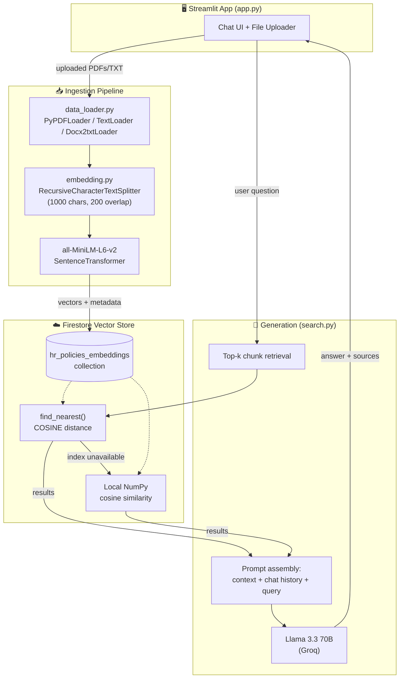
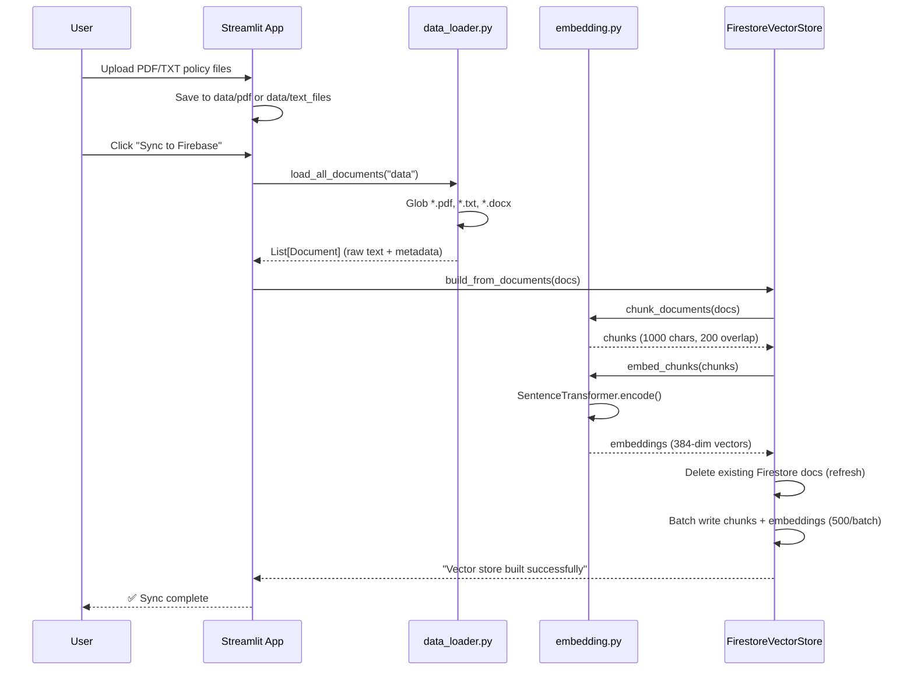
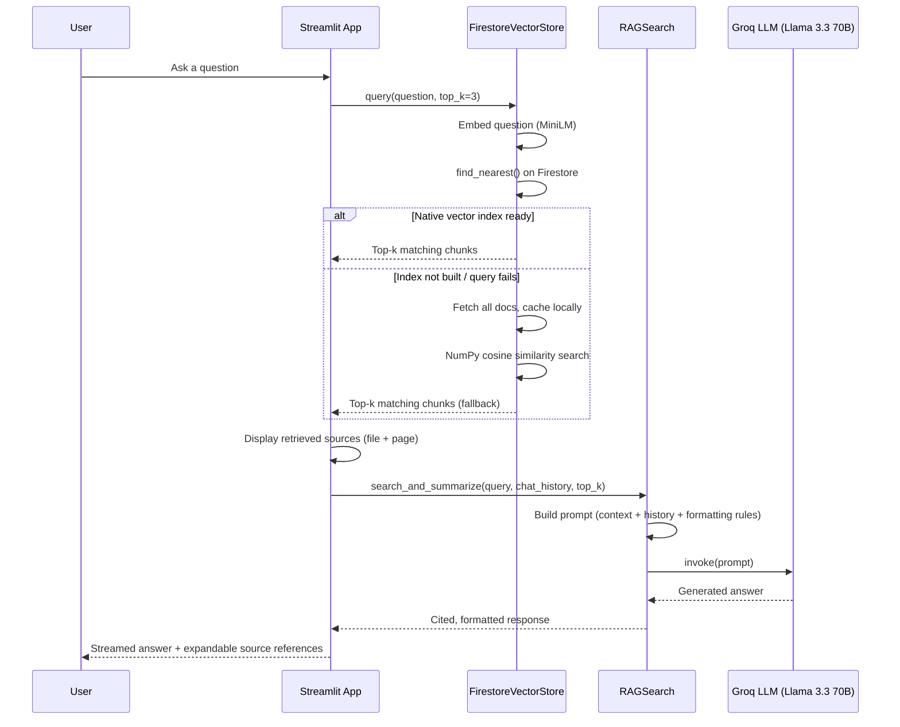

# 💼 HR Policies RAG Chatbot

A Retrieval-Augmented Generation (RAG) chatbot that answers natural-language questions about HR policies (leave policy, code of conduct, dress code, benefits, etc.) by semantically searching a corpus of policy documents and generating grounded, cited answers.

Built as a semantic search layer over public HR policy documents from Indian tech companies (Infosys, TCS, HCL-style handbooks), with a Streamlit front end and a serverless vector store on Firebase Firestore.

---

## ✨ Features

- **Semantic search**, not keyword matching — ask "how many sick days do I get?" and it finds the paragraph about medical leave even if it never uses the word "sick."
- **Multi-format ingestion** — PDF, TXT, and DOCX policy documents.
- **Cloud-native vector store** — embeddings live in Firestore, so there's no separate vector DB to host or manage.
- **Automatic fallback search** — if Firestore's native vector index isn't ready, the app transparently falls back to in-memory cosine similarity so the chatbot never goes down.
- **Conversational memory** — the LLM sees recent chat history, so follow-up questions ("what about for new hires?") work correctly.
- **Cited answers** — every response references the source document and page number it was pulled from.
- **Fast inference** — powered by Groq's LPU-hosted Llama 3.3 70B for near-instant generation.

---

## 🧱 Tech Stack

| Layer | Technology |
|---|---|
| Frontend / UI | [Streamlit](https://streamlit.io/) |
| Orchestration | [LangChain](https://www.langchain.com/) |
| Embeddings | `sentence-transformers/all-MiniLM-L6-v2` |
| Vector Store | [Google Cloud Firestore](https://cloud.google.com/firestore) (native vector search + local cosine fallback) |
| LLM | Llama 3.3 70B via [Groq](https://groq.com/) |
| Document Parsing | `pypdf`, `pymupdf`, `Docx2txt` |
| Package Management | [uv](https://github.com/astral-sh/uv) |

---

## 🗺️ System Architecture



---

## 🔄 Ingestion Pipeline (Indexing Flow)

Runs whenever new documents are uploaded and the user clicks **"Sync Uploaded Files to Firebase."**



---

## 💬 Query Pipeline (Chat Flow)

Runs on every chat message the user sends.



---

## 📂 Project Structure

```
hr_policies_rag_chatbot/
├── app.py                  # Streamlit UI — chat, uploads, sync controls
├── main.py                 # Package entrypoint stub
├── src/
│   ├── data_loader.py       # Multi-format document loading (PDF/TXT/DOCX)
│   ├── embedding.py         # Chunking + MiniLM embedding pipeline
│   ├── vectorstore.py       # FirestoreVectorStore (native + fallback search)
│   └── search.py            # RAGSearch — retrieval + Groq LLM generation
├── data/
│   ├── pdf/                  # Source HR policy PDFs
│   └── vector_store/         # (legacy local Chroma cache, pre-Firestore)
├── noteboook/                # Exploratory Jupyter notebooks
├── pyproject.toml            # uv-managed dependencies
└── requirements.txt
```

---

## ⚙️ Setup & Installation

### 1. Clone and install dependencies

```bash
git clone https://github.com/RaghuramMotukuri/hr_policies_rag_chatbot-.git
cd hr_policies_rag_chatbot-
uv sync
```

### 2. Configure credentials

Create a `.env` file in the project root:

```env
GROQ_API_KEY=your_groq_api_key_here
FIREBASE_CREDENTIALS_PATH=serviceAccountKey.json
```

Place your Firebase service account key (`serviceAccountKey.json`) in the project root. **Never commit this file** — add it to `.gitignore`.

### 3. Enable Firestore vector search (one-time)

Create a single-field vector index on the `embedding` field of the `hr_policies_embeddings` collection in the Firebase Console, or via `gcloud`:

```bash
gcloud firestore indexes composite create \
  --collection-group=hr_policies_embeddings \
  --query-scope=COLLECTION \
  --field-config=vector-config='{"dimension":384,"flat":{}}',field-path=embedding
```

> If this index isn't ready yet, the app automatically falls back to local in-memory cosine search — no downtime, just slightly slower queries.

### 4. Run the app

```bash
streamlit run app.py
```

### 5. Index your documents

Drop PDF/TXT files into the sidebar uploader, then click **"🔄 Sync Uploaded Files to Firebase."**

---

## 🧠 How Retrieval Works

1. Documents are split into **1000-character chunks with 200-character overlap** to preserve context across chunk boundaries.
2. Each chunk is embedded into a **384-dimensional vector** using `all-MiniLM-L6-v2` — small, fast, and good enough for semantic similarity on policy-style prose.
3. On query, the question is embedded with the same model and compared against stored vectors using **cosine similarity**.
4. The top-k (default 3) most relevant chunks are injected into the LLM prompt as grounding context, along with the last 6 turns of conversation history.
5. The LLM is instructed to **only answer from the provided context**, cite the source file and page number, and explicitly say when it doesn't have enough information — reducing hallucination.

---

## 🛣️ Roadmap / Known Limitations

- [ ] Add `.gitignore` (currently the legacy Chroma cache and large sample PDFs are tracked in git)
- [ ] Surface real similarity scores for the native Firestore search path (currently only the local fallback path computes them)
- [ ] Add automated tests for the ingestion and retrieval pipelines
- [ ] Support re-ranking (BM25 + dense hybrid) for higher precision on short queries
- [ ] Deploy demo instance

---

## 📄 License

This project is for educational/portfolio purposes. Sample HR policy documents included are publicly available reference materials used for demonstration only.
